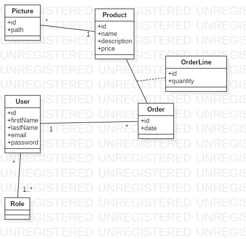

# Spring Hibernate

## Diagramme UML

Dans notre projet on va utiliser la conception suivante:



## Gradle Config

Pour intégrer Hibernate dans le projet, 
il faut ajouter ces ligne de code dans le fichier `build.gradle` :

```groovy

buildscript {
	ext {
		// ******
		jpaVersion = "2.1.1.RELEASE"
		mysqlConnectorVersion = "8.0.13"
	}
	// ****
}
```

```groovy
dependencies {

	// ******

	/**
	 * MySql
	 */
	compile group: 'org.springframework.boot', name: 'spring-boot-starter-data-jpa', version: "${jpaVersion}"
	compile group: 'mysql', name: 'mysql-connector-java', version: "${mysqlConnectorVersion}"

    // *****
	implementation 'org.springframework.boot:spring-boot-starter'
	testImplementation 'org.springframework.boot:spring-boot-starter-test'

}

```

## Création des Models

Par la suite on va créer un package `Model` contenant tous nos entités du projet

### Model User

```java
@Entity
public class User {

    @Id
    @GeneratedValue(strategy = GenerationType.AUTO)
    private Integer id;

    @Column(name = "first_name")
    private String firstName;

    @Column(name = "last_name")
    private String lastName;

    @Column(unique = true, nullable = false)
    private String email;

    @Column
    private String password;

    @ElementCollection(fetch = FetchType.EAGER)
    private List<Role> roles;

    @OneToMany(mappedBy = "user")
    private List<Order> orders;
}


```

### ENUM Role

```java

public enum Role {
    ROLE_ADMIN, ROLE_CLIENT;
}

```

### Model Product

```java
@Entity
public class Product {


    @Id
    @GeneratedValue(strategy = GenerationType.AUTO)
    private Integer id;

    @Column
    private String name;

    @Nullable
    @Column
    private String description;

    @Column
    private Double price;

    @OneToMany(mappedBy = "product")
    private List<Picture> pictures;
    
}

```

### Model Order

```java
@Entity
@Table(name = "Orders")
public class Order {

    @Id
    @GeneratedValue(strategy = GenerationType.AUTO)
    private Integer id;


    @ManyToOne
    private User user;

    @OneToMany(mappedBy = "order")
    private List<OrderLine> orderLines;

    @CreatedDate
    @Column(name = "created_date")
    private Date createdDate;
}

```

!!! info
    L'annotation `@Table` nous permet de spécifier un autre nom de table, on a modifier dans ce cas le nom du table par défaut car le nom `Order` est un nom réservé dans `MySQL`


### Model OrderLine

```java
@Entity(name = "Order_Line")
public class OrderLine {

    @Id
    @GeneratedValue(strategy = GenerationType.AUTO)
    private Integer id;

    @Column
    private Integer quantity;

    @ManyToOne
    private Product product;

    @ManyToOne
    private Order order;
}
```

### Model Picture

```java

@Entity
public class Picture {

    @Id
    @GeneratedValue(strategy = GenerationType.AUTO)
    private Integer id;

    @Column
    private String path;

    @ManyToOne
    private Product product;
}
```

## Configuration Hibernate

Dans le fichier `application.yml` ajouter le code suivant:

```groovy
spring:
  jpa:
    hibernate:
      ddl-auto: update
  datasource:
    username: root
    password:
    url: jdbc:mysql://localhost:3306/demoSpring?createDatabaseIfNotExist=true&serverTimezone=UTC
    driver-class-name: com.mysql.cj.jdbc.Driver
```

