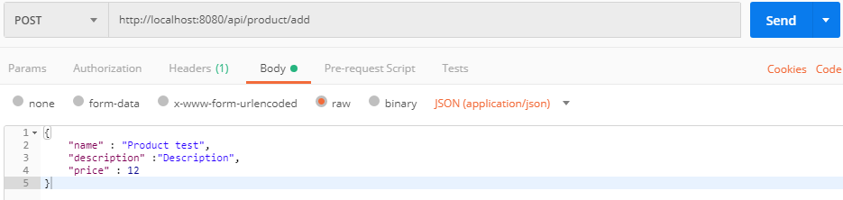
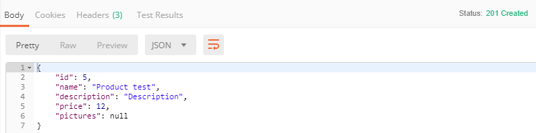

# Spring REST

On va exposer l'API pour les produits,
pour le moment un simple CRUD.
Créer un controlleur nommé `ProductController.java` :

```java
@RestController()
@RequestMapping("/api/product")
public class ProductController {
    
}
``` 

## Injection du Couche Service

Injécter `IProductService` afin de bénéficier des méthodes pour accéeder aux données
à traver la mot clé `@Autowired` .

```java
@RestController()
@RequestMapping("/api/product")
public class ProductController {

    @Autowired
    private IProductService productService;
}
```

## Ajout d'un produit

Ajouter ce bout de code dans le controleur:

```java
@RestController()
@RequestMapping("/api/product")
public class ProductController {

    @Autowired
    private IProductService productService;
    
    @PostMapping("/add")
    @ResponseStatus(HttpStatus.CREATED)
    public Product add(@RequestBody Product product) {
        return productService.add(product);
    }
}
```

Créer une interface `IProductService.java` et une classe `ProductService.java`
qui implémente cette interface.

```java
// IProductService.java
public interface IProductService {
     Product add(Product product);
}
```

```java
// ProductService.java
@Service
public class ProductService implements IProductService {

    @Autowired
    private ProductRepository productRepository;
    
    @Override
    public Product add(Product product) { 
        return productRepository.save(product);
    }
}
```

Créer une interface `ProductRepository.java` qui hérite de l'interface `JpaRepository`

```java
public interface ProductRepository extends JpaRepository<Product, Integer> {
}
```

## Tester avec postMan

### Example de requéte




### Example de réponse 


## Affichage liste des produits
Ajouter ce bout de code dans le controleur:

```java
@RestController()
@RequestMapping("/api/product")
public class ProductController {

    @Autowired
    private IProductService productService;
    
    @GetMapping("")
    @ResponseStatus(HttpStatus.ACCEPTED)
    public List<Product> getAll() {
        return productService.getAll();
    }
}
```

```java
// IProductService.java
public interface IProductService {
      List<Product> getAll();
}
```

```java
// ProductService.java
@Service
public class ProductService implements IProductService {

    @Autowired
    private ProductRepository productRepository;
    
    @Override
    public List<Product> getAll() {
        return productRepository.findAll();
    }
}
```

## Affichage du produit par son id

Ajouter ce bout de code dans le controleur:

```java
@RestController()
@RequestMapping("/api/product")
public class ProductController {

    @Autowired
    private IProductService productService;
    
    @GetMapping("/{productId}")
    @ResponseStatus(HttpStatus.OK)
    public Product getById(@PathVariable("productId") Integer productId) {
        return productService.getById(productId);
    }
}
```

```java
// IProductService.java
public interface IProductService {
    Product getById(Integer productId);
}
```

```java
// ProductService.java
@Service
public class ProductService implements IProductService {

    @Autowired
    private ProductRepository productRepository;
    
    @Override
    public Product getById(Integer productId) {
        return productRepository.findById(productId).orElse(null);
    }
}
```
## Modification d'un produit

Ajouter `ProductDTO.java` pour notre requéte de modification:

```java
public class ProductDTO {

    private String name;

    private String description;

    private Double price;
}
```

!!! warning
    N'oublier pas les getters/setters !! 


On va ajouter le plugin `ModelMapper` afin de mapper entre notre DTO et notre objet `Product.java`

`gradle.build` :

```groovy
dependencies {
	//****
	
	compile group: 'org.modelmapper', name: 'modelmapper', version: '1.1.0'
	
	implementation 'org.springframework.boot:spring-boot-starter'
	testImplementation 'org.springframework.boot:spring-boot-starter-test'
}
```


```java
@RestController()
@RequestMapping("/api/product")
public class ProductController {

    @Autowired
    private IProductService productService;
    
    @Autowired
    private ModelMapper modelMapper;
    
    @PutMapping("/{productId}")
    @ResponseStatus(HttpStatus.OK)
    public Product update(@PathVariable("productId") Integer productId, @RequestBody ProductDTO productDTO) {

        Product product = productService.getById(productId);
        if (product != null) {
            Product productData = modelMapper.map(productDTO, Product.class);
            return productService.update(product, productData);
        }
        return null;
    }
}
```

!!! info
    Remarquez-vous que le code ne fonctionne pas ? 


En faite il faut que le `modelMapper` sera injecté dans notre application,
il n'est pas injecté par defaut.
Pour ce là:

```java
// DemoSpringApplication

@SpringBootApplication
public class DemoSpringApplication {

	// ******

	@Bean
	public ModelMapper modelMapper() {
		return new ModelMapper();
	}

}

```

```java
// IProductService.java
public interface IProductService {
    Product update(Product product, Product productData);
}
```

```java
// ProductService.java
@Service
public class ProductService implements IProductService {

    @Autowired
    private ProductRepository productRepository;
    
    @Override
    public Product update(Product product, Product productData) {

        if (productData.getName() != null) {
            product.setName(productData.getName());
        }

        if (productData.getDescription() != null) {
            product.setDescription(productData.getDescription());
        }

        if (productData.getPrice() != null) {
            product.setPrice(productData.getPrice());
        }

        return productRepository.save(product);
    }
}
```

## Suppression d'un produit

Ajouter ce bout de code dans le controleur:

```java
@RestController()
@RequestMapping("/api/product")
public class ProductController {

    @Autowired
    private IProductService productService;
    
    @DeleteMapping("/{productId}")
    @ResponseStatus(HttpStatus.OK)
    public SimpleResponse delete(@PathVariable("productId") Integer productId) {

        Product product = productService.getById(productId);
        if (product != null) {
            productService.delete(productId);
            return new SimpleResponse("Delete product success");
        }
        return null;
    }
}
```

```java
// IProductService.java
public interface IProductService {
    void delete(Integer productId);
}
```

```java
// ProductService.java
@Service
public class ProductService implements IProductService {

    @Autowired
    private ProductRepository productRepository;
    
    @Override
    public void delete(Integer productId) {
        productRepository.deleteById(productId);
    }
}
```

!!! warning
    Il va falloir ajouter `@JsonIgnore` dans `Picture.java` comme suit:
    
```java
@Entity
public class Picture {

    // ****

    @ManyToOne
    @JsonIgnore
    private Product product;
}
```